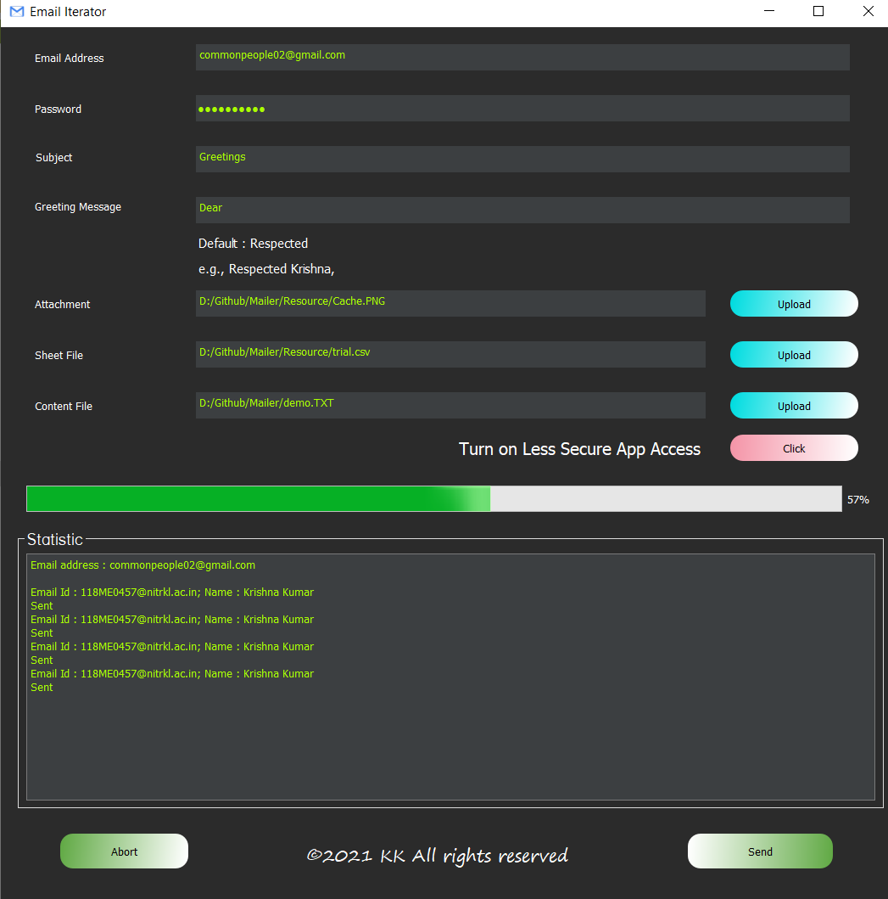
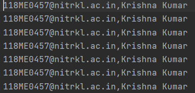
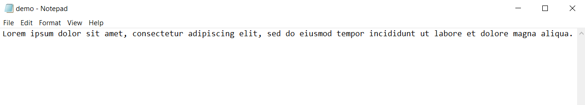
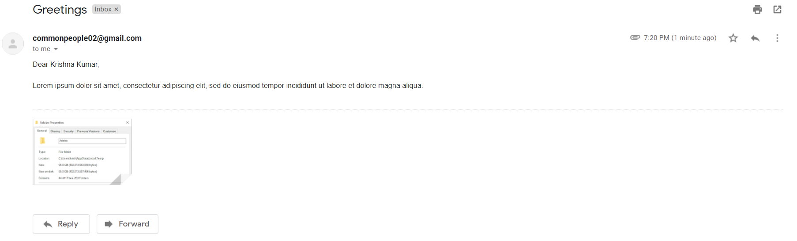

# Mailer

A GUI to send mail to the multiple user just on a single click

## 📌 Prerequisites
- Windows 10
- [Python](https://www.python.org/downloads/release/python-387/) (Python 3.8.7)

## ⭐ Preview

## 👍 Demo

### Sheet File

The csv file should have at least two columns of which the first column should contain the email address and the second column should contain the corressponding name. The further columns won't affect the mail sending process. A demo preview of the csv file should look as below,

### Content File

The content file should be a TXT file containing the text of the body of email to be sent to the destimation email addressed present in sheet file. A preview of demo content file should look as below,

### Attachment File

The attachment file may or may not be selected by the user. If selected, should be of image file format(namely, jpeg, jpg, png).

### Less Secure App Access

The less secure app access of the email address from which the mail will be sent should be turned on. The button aside less secure app access in GUI shall redirct to less secure app access web page.

### Preview of a mail

