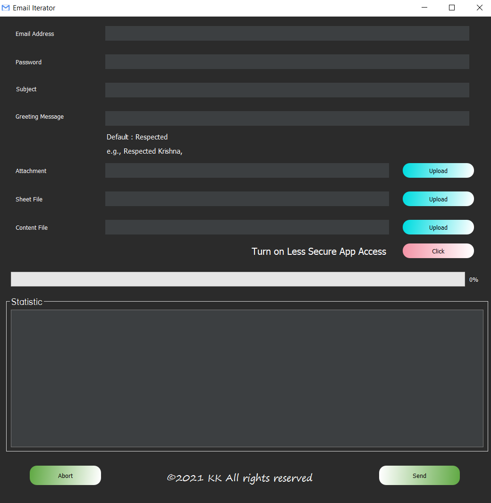

# Mailer

A GUI to send mail to the multiple user just on a single click

## 📌 Prerequisites
- Windows 10
- [Python](https://www.python.org/downloads/release/python-387/) (Python 3.8.7)

## Preview

